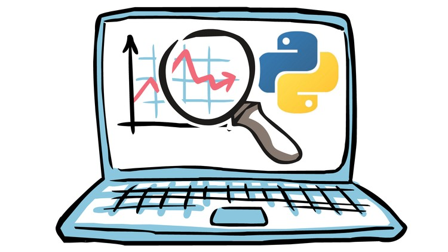

# Tableau Dashboards

## CITI Bike User Information Analysis
* Tableau Public: [Biker User Information (Janurary vs. July)](https://public.tableau.com/views/Homework_16145381512240/Dashboard1?:language=en&:retry=yes&:display_count=y&:origin=viz_share_link)

* Background: Since 2013, the [New York Citi Bike](https://en.wikipedia.org/wiki/Citi_Bike) Program has implemented a robust infrastructure for collecting data on the program's utilization. Through the team's efforts, each month bike data is collected, organized, and made public on the [Citi Bike Data](https://www.citibikenyc.com/system-data) webpage. However, while the data has been regularly updated, the team has yet to implement a dashboard or sophisticated reporting process. City officials have a number of questions on the program, so the goal for this project is to build a set of data reports to provide the answers.

## Stock Market Performance and Prediction
* Tableau Public: [Stock Market Performance Overtime (2000-2021)](https://public.tableau.com/views/StockMarketAnalysis_16148159340840/TrendAnalysis?:language=en&:display_count=y&:origin=viz_share_link)

* Tableau Public: [Stock Market Performance Prediction](https://public.tableau.com/views/StockMarketPrediction_16157795216330/Dashboard1?:language=en&:display_count=y&:origin=viz_share_link)

* Background: How does the stock market perform overtime? What are the trends for the stock market's decline and recovery overtime? How would the information help us make a more informed decision when investing in the stock market in the future? These two Tableau Dashcards provide data analysis that enables you to visualize the overall trend of the stock market and a one-year prediction of the stock market performance.
